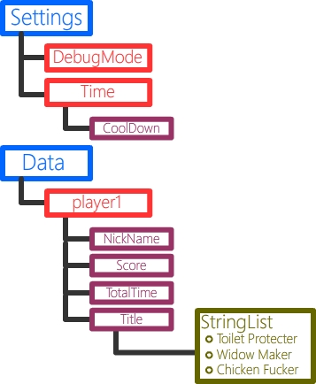

# 认识配置文件

> 最开始的版本被吐槽太复杂啰嗦, 因此所以这一章的内容被重新改写.  
> [最开始的版本请点击本行文字.](brm-1-4-old.md)

## 配置文件
配置文件用来储存配置信息, 以便使用文件开关功能、储存数据、修改信息.  
我们往往需要读写配置文件. Bukkit为我们提供了配置API.   

## 配置API
配置API是BukkitAPI提供的读写配置文件的工具. 其相对而言较为简单, 是插件开发中常用的API.  

*目前为止, 配置API只有YAML配置功能可用. 这也是大多数插件为什么配置文件是YAML文件的原因.  
在本文中, 我们也将使用YAML配置API.*   
*现在的配置API的类均在 `org.bukkit.configuration` 和 `org.bukkit.configuration.file` 包中.*   

# 了解YAML文件

## 键值对

相信开服的经验已经使你对YAML文件有了初步认识.  
YAML文件的文件后缀是`.yml`. 其配置文件结构需要严格遵守YAML标准.  

下面是一个符合标准的YAML配置文件的内容:  

```yaml
Settings:
  DebugMode: true
  Time:
    CoolDown: 10
Data:
  player1:
    NickName: HandsomeBoy
    Score: 50
    TotalTime: 40
    Title:
    - Toilet Protecter
    - Widow Maker
    - Chicken Fucker
```

相信你可以**根据空格看出每个项目之间的所属关系**, 如下:  



**我们把上面所属关系图中, 矩形框内的东西叫做键(Key)**. 例如, `Settings`是一个键, `Data`是个键. **在`Settings`键下存在`DebugMode`、`Time`两个子键, 它们分别叫做`Settings.DebugMode`键和`Settings.Time`键**. 同理, 在`Settings.Time`键下还有`CoolDown`这个子键, 这个子键叫`Settings.Time.CoolDown`键.  

我们可以用这样的命名方法来称呼一个YAML文件中的任一一个键了. 并且还可以根据名称看出所属关系.  
例如, `Data.player1.Score`键对应的值是 `50`.

在YAML中, 键和值一一对应, 一个键一定会有一个值.

## 数据类型

通常可以用配置文件存储一些基本类型(int、double、boolean)、String、数组和可被序列化的对象.  

Bukkit中给出的一些对象有些是可以直接存进配置文件的, 这需要看这个类是不是实现了`ConfigurationSerializable`接口. 例如, `Player`类型的对象就可以被直接存入配置文件, 因为查阅JavaDoc后可以发现它实现了`ConfigurationSerializable`.  


*后续会详细介绍, 这里需要知道判断方法.*

在上面的配置文件中, 配置文件里储存了:  
1. 存储了一个`boolean`类型的值(`Settings.DebugMode`键).  
2. 存储了一些数字类型的值.  
3. 存储了一个`String`字符串(`Data.player1.NickName`键).  
4. 存储了一个`StringList`(YAML里的`StringList`就是Java中的`List<String>`, 例如`Data.player1.Title`键).  

YAML中注释以`#`表示.  
```yaml
#就像这样写注释, 配置文件读取时会忽略掉注释
Settings:
  DebugMode: true
```

相信你可以通过这个例子明白配置文件中可以储存哪些数据了.

## 对于不存在的数据

很明显, 上面的配置文件中, 并没有`Data.player2.NickName`键, 那么如果我非要获取`Data.player2.NickName`键的值, 获取到的数据是什么呢?  
答案是null. 换句话说, **YAML里所有不存在的键, 值是null.**  

请记住这句话. 我们可以根据这个原理推导出, 如果你想删除一个已经存在的键, 那就是把这个键的值设置为null.

# 操作默认配置文件

这里的默认配置文件指的是`config.yml`文件.  
首先我们需要准备一个默认的`config.yml`文件. 这个文件会在插件检测到`plugins\插件名`文件夹下没有`config.yml`文件时被放入该文件夹中.  
在插件jar文件里, 默认的`config.yml`文件要与`plugin.yml`文件处于同一目录下, 所以创建默认`config.yml`的方法与创建`plugin.yml`文件的操作方法一致. 在这里我们在默认`config.yml`文件中存入我们一开始举的例子.

## 读取config.yml数据
 下面做一个插件, 在玩家登陆服务器时, 给玩家显示配置文件`Data.玩家名.Score`键对应的值.

```java
public class HelloWorld extends JavaPlugin implements Listener{
    public void onEnable(){
        saveDefaultConfig(); //这个代码会自动判断插件配置文件里是不是有config.yml, 没有就会放入默认的config.yml
        Bukkit.getPluginManager().registerEvents(this,this);
    }  
  
    public void onDisable(){}
  
    @EventHandler
    public void onPlayerJoin(PlayerJoinEvent e){
        //在这里我们监听了PlayerJoinEvent, 并操作`config.yml`
        String key = "Data." + e.getPlayer().getName() + ".Score"; //这是我们要获取的键名
        int score;
        if(getConfig().contains(key)){ //先判断一下有没有这个键
            score = getConfig().getInt(key); //有的话读取
        } else {
            score = 0; //没有的话就按0处理
        }
        e.getPlayer().sendMessage("你的积分是: " + score); //然后给玩家发送
    }
}
```

这里想说明, 如果你用`getConfig().getString(key)`获取玩家数据`Score`键的值, 那么获取到的就是一个String字符串.  
也就是, 一个键对应的值是什么数据类型, 完全取决于你用的getter是什么.  

## 写入数据到config.yml

我们再来做个"加分项", 玩家挖掉一个石头后, 给他加分.

```java
public class HelloWorld extends JavaPlugin implements Listener{
    public void onEnable(){
        saveDefaultConfig();
        Bukkit.getPluginManager().registerEvents(this,this);
    }  
  
    public void onDisable(){}
  
    @EventHandler
    public void onPlayerJoin(PlayerJoinEvent e){
        //这里代码跟上面是一模一样的, 这里只是做了简化, 因为原先的if占篇幅太大
        String key = "Data." + e.getPlayer().getName() + ".Score";
        int score = getConfig().contains(key)?getConfig().getInt(key):0;
        e.getPlayer().sendMessage("你的积分是: " + score);
    }

    @EventHandler
    public void onBlockBreak(BlockBreakEvent e){
        if (e.isCancelled()) return; //判断此事件是不是被其它插件取消掉了
        if(e.getBlock().getType() == Material.STONE){ //判断类型, 是石头
            String key = "Data." + e.getPlayer().getName() + ".Score";
            int score = getConfig().contains(key)?getConfig().getInt(key):0; //获取玩家当前积分, 如果从未记录此玩家的积分数据则默认为0
            getConfig().set(key,score + 10); //挖一个石头加10分

            //但是写到这里要小心！你只是修改了内存上的数据, 你没有修改硬盘上的config.yml文件里的数据！
            saveConfig(); //所以要注意, 修改数据要记得保存
        }
    }
}
```

由此, 你需要小心, **getConfig()的内容是内存上的内容, 修改它并没有修改硬盘上的内容, 关服/重载后就会消失, 因此要注意保存！**

`set`不区分数据类型是什么, 存储数据全部都用`set`方法. `set`不管这个键在配置文件里存不存在, 都会写入这个数据.

还记得我们一开始说的`YAML里所有不存在的键, 值是null`吗? 如果你想删除掉`player3`的数据, 那你应该写成:  

```java
getConfig().set("Data.player3",null);
```

这样配置文件里`Data`键下就没有`player3`的数据了,也就达到了删除一个键的目的.

# 操作自定义的配置文件
关于非`config.yml`的YAML文件的操作, 有很多种方式可以做到.  
下文叙述的是其中的一种.

## 准备默认配置文件
我们还是需要像`config.yml`那样准备一份默认配置文件, 放在与plugin.yml相同目录下. 不同的是, 除了`saveDefaultConfig`以外, 我们还需要其他的代码来保存默认配置文件.  

例如我们有`config.yml`和`biu.yml`两个配置文件, 插件加载时应该这样生成默认配置文件:  
```java
this.saveDefaultConfig(); //生成默认config.yml
this.saveResource("biu.yml", false); //生成默认biu.yml
```
*`saveResource`方法的第一个参数是文件名, 第二个参数是是否覆盖, 设置成false可以达到saveDefaultConfig的效果.*  

同理,利用`saveResource`可以生成你想生成的默认的非`config.yml`的配置文件.

如果我想实现在插件配置文件夹创建一个新的文件夹存放配置文件怎么做呢? 很简单:  
```
this.saveResource("test\biu.yml", false); //生成默认biu.yml, 放在test文件夹里, Jar文件中也需要有test文件夹
```

## 基本读写与保存
下面是一个读写与保存的示例:
```java
// 读取配置文件
// this.getDataFolder()方法返回插件配置文件夹的File对象
File biuConfigFile = new File(this.getDataFolder(), "biu.yml");
// 也可以在插件配置文件夹创建一个新的文件夹以存放配置文件
// File biuConfigFile = new File(this.getDataFolder(), "test/biu.yml");
FileConfiguration biuConfig = YamlConfiguration.loadConfiguration(biuConfigFile);
biuConfigFile.get.......
biuConfigFile.set.......
// set完了记得保存!
biuConfig.save(biuConfigFile);
```